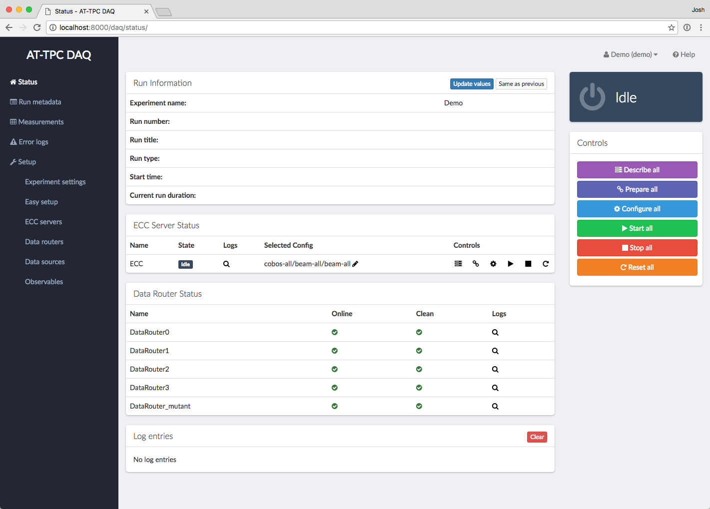
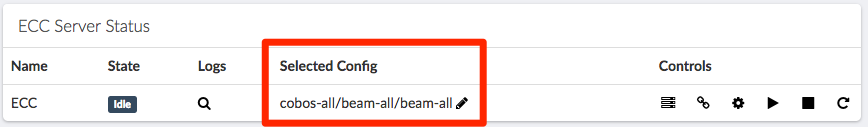
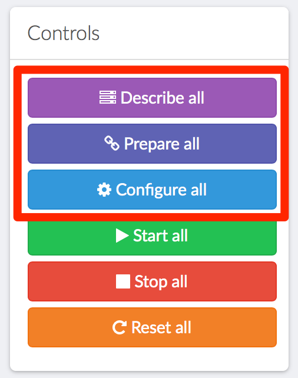
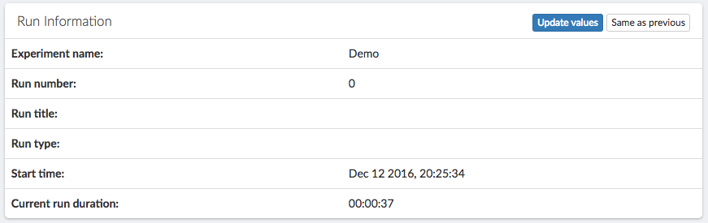

Operating the DAQ system
========================

As said before, the DAQ system consists of two main parts: the web service for controlling the system and the remote
components from the GET software (see :ref:`get_software`) that run on the Mac Minis. All of these parts need to be
running before you can record data.

Web GUI status page
-------------------

When you first open the web interface, you will see the login page:

..  image:: images/daq_login.png
    :width: 600 px
    :align: center

You should log in using a username and password associated with a particular experiment. Note that this is *not*
the same as the DAQ web app's administrator username and password.

After logging in, you will arrive at the main status page:

This page shows an overview of what's currently happening in the system. It is divided into a set
of panels:

Run Information
    This panel has details about the current current run, like how long it has been going and
    what run number is currently being recorded.

Data Source Status
    This panel lists the status of each CoBo the system knows about. The "CoBo Status" indicator
    shows what state machine state the CoBo is in (i.e. "Idle", "Ready", "Running", etc.). The
    "DAQ Status" indicator shows the state of the remote GET processes on the Mac Minis. This
    will let you know if one of the processes has crashed or if you need to wait a moment for
    a file management task to finish. The "Selected Config" indicator lists the name of the
    config file that will be used to configure the CoBo. Finally, the "Controls" column contains
    a set of buttons for changing the state of an individual CoBo. These should only be used
    for troubleshooting purposes.

Log Entries
    This panel will show the latest error messages from the web interface. This does not include
    error messages that may be produced by the GET software. You can click on an individual
    error to get more information and possibly a traceback. Finally, clicking "Clear" will
    discard all error messages.

Controls
    This set of large buttons configures the entire system at once. This is what you should use to
    control the system. The reset button will step the system back one state. For example, if the
    system is in the "Ready" state, pressing Reset will step it back to "Prepared".

Selecting a configuration
-------------------------

Once all necessary processes are up and running, the status page should display a CoBo status of "Idle" and
a DAQ status of "Ready" for each data source. At this point, you should select a config file for each CoBo.

Config files can be selected by clicking the pencil icon next to the current config name in the Selected Config
column of the Data Source Status panel.

This will bring up a page with a drop-down menu listing the configurations available for that data source. The
list of available configurations contains all possible permutations of the set of ``describe-*.xcfg``,
``prepare-*.xcfg``, and ``configure-*.xcfg`` files known to the ECC server. Each configuration is identified by
a name composed of the names of the three ``*.xcfg`` files that go into it, formatted as
``[describe-name]/[prepare-name]/[configure-name]``. For example, if you want to configure a data source using the files
``describe-cobo0.xcfg``, ``prepare-experiment.xcfg``, and ``configure-experiment.xcfg``, then you should choose the
configuration called ``cobo0/experiment/experiment``. See :ref:`config_files` for more information about these files
and their naming convention.

Preparing to take runs
----------------------

After selecting a configuration, the CoBos must be configured to prepare them to take data. This can be done using
the first three buttons on the main Controls panel.

Begin by clicking the "Describe all" button. The system will then send a message to the ECC servers telling them
to execute the "Describe" transition on the CoBos. The CoBo status label for each source should then disappear and
be replaced by a spinning cursor. Once the transition is finished, each CoBo should list a status of "Described",
and the overall system status in the top-right corner should also be shown as "Described."

..  note::
    These system-wide buttons only work if *all* data sources are in the same state. If the sources are in different
    states, you will need to use the individual controls in the Data Source Status panel to bring them into the
    same state.

The next two steps are nearly identical. Click the "Prepare all" button, and wait until the status on each source
is shown as "Prepared." Finally, click "Configure all," and wait for a status of "Ready." At this point, the system
is ready to take data.

..  note::
    If one or more of the CoBos fails to complete the state transition, it will remain in whatever state it started in.
    This will be apparent since that CoBo will have a different label from the others, and the overall system status
    in the top-right corner will be shown as "Error." If this happens, look for an error message in the "Log entries"
    panel at the bottom of the page, and try to diagnose the problem. Once the problem is fixed, try using the
    individual source controls in the Data Source Status panel to bring the troublesome CoBo to the same state as
    the others.

Starting and stopping runs
--------------------------

Runs are controlled using the "Start all" and "Stop all" buttons in the main Controls panel.

Once you click "Start all," the CoBos will begin recording data and the Run Information panel should update
to reflect the new run.

..  danger::
    Data taking on the CoBos can also be started and stopped using the individual source control buttons on the
    Data Source Status panel; however, if this is done, **the global run number will not be updated**. Therefore, these
    individual buttons should *only* be used in the case of an error where a CoBo fails to start recording data.

Metadata about each run can be edited on the Run Metadata page, which can be accessed by clicking the link in the
left-hand navigation menu. This is fine to do during a run; the run will continue without interruption even if the
status page is not visible.

..  image:: images/run_metadata_page.png
    :width: 600 px
    :align: center

The metadata can be edited for a run by clicking the Edit button for that run. This allows you to set the run title,
for example.

When it is time to stop a run, click the "Stop all" button. This will tell the CoBos to stop recording data, and it
will also tell the system to connect to each Mac Mini and rearrange the data files into a directory for the
just-completed run.

..  warning::
    It may take several seconds for the data files to be rearranged for each data source. You **must** wait until
    this process is complete before starting a new run, or else the files for multiple runs may be mixed together.
    You can tell if this process is complete by looking at the DAQ Status column in the Data Source Status panel.
    If the status is not "Ready," do *not* start a new run.

Resetting the system
--------------------

When an experiment is complete, or when you want to re-configure the CoBos, the system should be reset to the "Idle"
state. This can be done by using the "Reset all" button in the main Controls panel. One click of this button will
step each CoBo back by one state in the state machine (see :ref:`cobo_state_machine`).

..  note::
    Each transition must finish before clicking the Reset button again.

