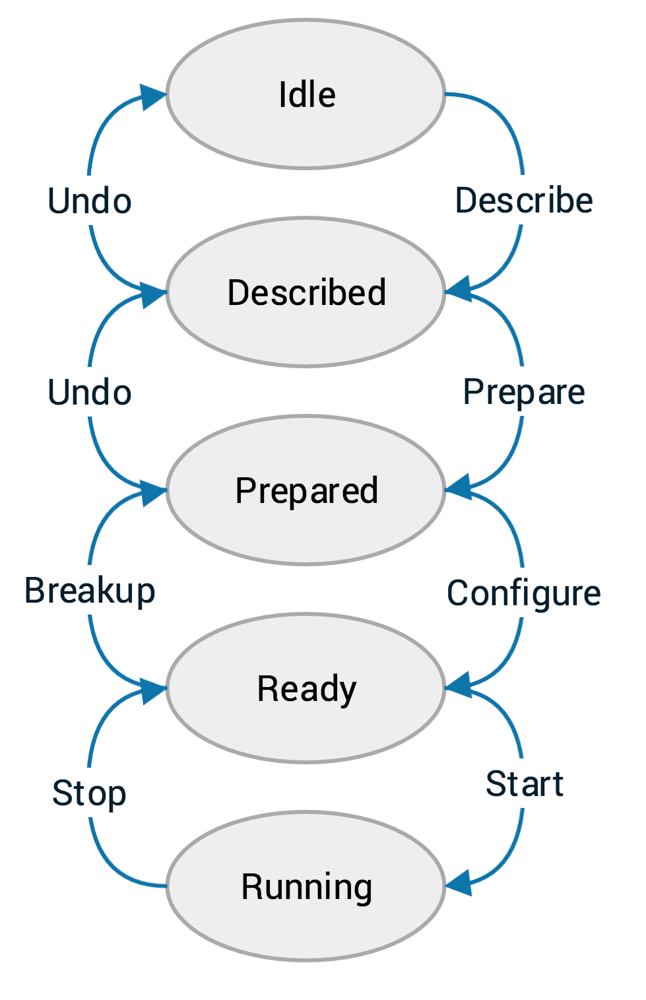

Overview of DAQ system
======================

The AT-TPC DAQ is based on a collection of programs provided by the GET collaboration. These provide the back-end of the
system by handling CoBo configuration and data recording. This web application serves as a front-end for those programs.

..  _get_software:

GET software components
-----------------------

There are two programs, in particular, that need to be running for each CoBo. They are:

getEccSoapServer
    This program controls the CoBo. It sends the configuration to the CoBo and tells it when to start and stop
    acquisition.

dataRouter
    This program records the data.

The web interface controls the system by acting as a client for the getEccSoapServer. It does not communicate with the
dataRouter directly.

..  _cobo_state_machine:

CoBo state machine
------------------

The ECC server controls the CoBo using the model of a state machine. This means that that CoBo can be in one of several
well-defined *states*, and to change from one state to another, it will undergo a well-defined *transition*. The state
machine for the CoBo looks like this:

The ellipses represent the different states that the system may be in, the arrows along the right side show the
forward state transitions, and the arrows along the left show the reverse state transitions.

..  _config_files:

Config files
------------

Each forward transition requires a particular part of the configuration file. This is why we have three config files
for each setup (or, alternatively, two true files and one symbolic link). The expected files are named:

- ``describe-[name].xcfg`` for the describe step
- ``prepare-[name].xcfg`` for the prepare step
- ``configure-[name].xcfg`` for the configure step

These names will be shown stripped of their prefix and suffix in the DAQ interface. For example, a file called
``describe-cobo0.xcfg`` will be shown as simply ``cobo0``.

Web-based GUI
-------------

The interface to the system is a web application written in Python 3 using the
`Django web framework <https://www.djangoproject.com>`_ for the back-end with `Bootstrap <http://getbootstrap.com>`_
providing the front-end. The structure of the code is described briefly in :ref:`code_docs` and in comments
directly in the code itself.

As Django apps can be a bit tricky to serve, the app has been structured to run inside
`Docker <https://www.docker.com>`_ containers. The Dockerized version of the app can be built using the Docker compose
utility like this:

..  code-block:: shell

    docker-compose build

This will create Docker containers for the following processes:

PostgreSQL (container/service ``db``)
    This is the database used to store the internal configuration of the web app. This stores things like the IP
    addresses of the Mac Minis, the name of the config file to use for each CoBo, the history of recent runs, and the
    name of the current experiment.

RabbitMQ (container/service ``rabbitmq``)
    RabbitMQ is a "message broker" that coordinates communication between the main processes of the Django application
    and the Celery distributed task queue system (see below). It needs to be running, but otherwise it is not
    particularly interesting from the perspective of the DAQ system.

Django/Gunicorn (container/service ``web``)
    This container hosts the Gunicorn web server which serves the dynamically generated portion of the web app. This
    is the container where the Python code of the Django application is running.

Celery (container/service ``celery``)
    Celery is a distributed task queue system. It receives messages from Django via the RabbitMQ broker and schedules
    tasks accordingly. This allows asynchronous execution of portions of the web app's code. For example, when you
    configure the CoBos, a set of tasks is sent to the Celery server that tell it to perform the configuration. This
    allows the configuration step to occur in parallel for each CoBo, and it prevents the web interface from blocking
    while the configuration process is taking place.

Nginx (container/service ``nginx``)
    Nginx is a commonly used web server. It serves the static content of the web app, like CSS files and this help
    documentation.
